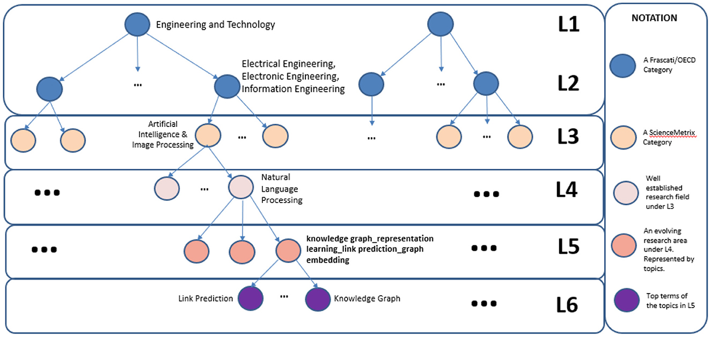

# SciNoBo Field of Science Taxonomy

The taxonomy has 6 Levels (L1-L6). The levels from L1-L3 are static and stem from the OECD and ScienceMetrix taxonomy. The rest of the levels are algorithmically constructed utilizing publication-to-publications and venue-to-venue citation graphs as well as clustering and topic modelling algorithms. The resulting L5s are topics stemming from topic modelling. We utilize open-source LLMs and more specifically Llama3 to automatically assign a scientific name to each L5 topic. 

To view the FoS labels (L1-L3), please visit: [OpenAIRE FoS](https://explore.openaire.eu/fields-of-science). A snapshot of the taxonomy is visible below:

## Snapshot of the FoS taxonomy.



## Publications:
- [SCINOBO: a novel system classifying scholarly communication in a dynamically constructed hierarchical Field-of-Science taxonomy](https://www.frontiersin.org/articles/10.3389/frma.2023.1149834/full)
- [SciNoBo: A Hierarchical Multi-Label Classifier of Scientific Publications](https://dl.acm.org/doi/10.1145/3487553.3524677)

The file containing the FoS taxonomy is a JSONL file and each line contains the following information:

- "level_1": The L1 of the FoS taxonomy
- "level_2": The L2 of the FoS taxonomy
- "level_3": The L3 of the FoS taxonomy
- "level_4": The L4 of the FoS taxonomy - This is a cluster of publications. The name stems from Wikipedia pages.
- "level_5": The L5 of the FoS taxonomy - This is a topic stemming from topic modelling in a cluster of publications. The L5 topic is the most frequent topic of the cluster. The rest of the topics are treated as L6. This is why a topic in L5 also occurs once in L6.
- "level_6": The L6 of the FoS taxonomy - This is a topic under L5, we treat each ngram in the topic description as a scientific kw and thus a L6.
- "level_4_id": A unique identifier for a L4
- "level_5_id": A unique identifier for a L5
- "level_5_name": The automatically assigned scientific name of the L5 topic, using open-source LLMs.

## Examples:

```json
{
    "level_1": "engineering and technology", 
    "level_2": "electrical engineering, electronic engineering, information engineering", 
    "level_3": "artificial intelligence & image processing", 
    "level_4": "natural language processing/computational linguistics", 
    "level_4_id": "L4_artificial intelligence & image_9", 
    "level_5_id": "L4_artificial intelligence & image_9_24", 
    "level_5": "translation ---- machine ---- machine translation ---- language ---- neural ---- nmt ---- neural machine translation ---- neural machine ---- base ---- resource", 
    "level_6": "translation ---- machine ---- machine translation ---- language ---- neural ---- nmt ---- neural machine translation ---- neural machine ---- base ---- resource", 
    "level_5_name": "neural machine translation"
}
```

```json
{
    "level_1": "medical and health sciences", 
    "level_2": "clinical medicine", 
    "level_3": "oncology & carcinogenesis", 
    "level_4": "oncology/infectious causes of cancer", 
    "level_4_id": "L4_oncology & carcinogenesis_5", 
    "level_5_id": "L4_oncology & carcinogenesis_5_237", 
    "level_5": "tumor ---- malignant ---- gct ---- cell tumor ---- granular cell tumor ---- cell ---- granular cell ---- granular ---- case ---- patient", 
    "level_6": "tumor ---- malignant ---- gct ---- cell tumor ---- granular cell tumor ---- cell ---- granular cell ---- granular ---- case ---- patient", 
    "level_5_name": "granular cell tumor"
}
```
